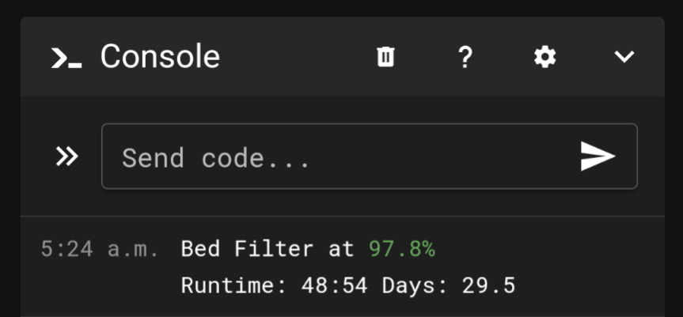

# Filter Monitor

This Klipper plugin monitors the runtime of air filters (Nevermore, THE FILTER, etc), and triggers notifications and/or executes G-code when threshold conditions, such as max runtime or lifetime hours, are met. These monitoring checks also occur on pre-defined system events and keep track of total fan runtime.



## Installation

To install this plugin, first ensure that you already have Klipper, Moonraker, and a WebUI (Mainsail, Fluidd, or Octoprint) installed on your printer. If not, you can use [KIAUH](https://github.com/dw-0/kiauh) to facilitate the process.

Then, execute the following command over SSH. The script will clone this GitHub repository to your device's home directory, and symlink the required files into the Klipper "extras" folder.

```
wget -O - https://raw.githubusercontent.com/blankhaus/klipper-filter_monitor/main/install.sh | bash
```

Then, add the following to moonraker.conf to enable automatic updates:

```ini
[update_manager filter_monitor]
type: git_repo
path: ~/klipper-filter_monitor
origin: https://github.com/blankhaus/klipper-filter_monitor.git
managed_services: klipper moonraker
primary_branch: main
install_script: install.sh
```

## Usage

#### Quick Configuration

```ini
[filter_monitor bed_filter]
fan: 'fan_generic bed_fans'
```

#### Full Configuration

```ini
[filter_monitor bed_filter]
fan: 'fan_generic bed_fans' # e.g fan_generic bed_filter, heater_generic heated_chamber, etc
max_runtime_hours: 50 # Defaults to 50 hours
max_days: 30 # Defaults to 30 days
interval: 30 # Defaults to 30 seconds
expiry_gcode: # Executed when filter meets threshold condition
path: ~/printer_data/config/plugins/filter_monitor # Folder where filter data is stored
```

#### Macros

```ini
FILTER_STATS NAME=<name> [EXTENDED=1]
```

```ini
RESET_FILTER NAME=<name>
```

## Removing Plugin

To uninstall this plugin, execute the following command over SSH. The script will remove any symlinked files related to this plugin from the Klipper "extras" and "plugins" folders.

```
wget -O - https://raw.githubusercontent.com/blankhaus/klipper-filter_monitor/main/uninstall.sh | bash
```

## Support

Feel free to shoot me a message on Discord. You'll find me under **mut3x_** on either the Voron or Klipper servers.

[](https://ko-fi.com/M4M3125C21)
